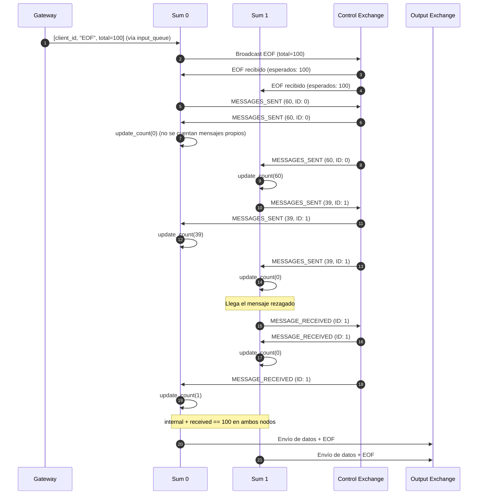

# Informe Técnico: Coordinación y Escalabilidad en Sistema Distribuido

## 1. Introducción y Arquitectura General

El sistema implementado en Python resuelve el cálculo distribuido del top de frutas con mayor stock a partir de flujos de datos enviados concurrentemente por múltiples clientes. La solución sigue una arquitectura de pipeline por etapas desacopladas mediante el middleware de mensajería **RabbitMQ**, garantizando alta concurrencia, procesamiento paralelo y tolerancia a cambios en la multiplicidad de los nodos.

El flujo de procesamiento se divide en las siguientes etapas:
1. **Gateway**: Punto de enlace TCP con los clientes. Asigna a cada conexión un identificador único (`client_id` vía UUID v4) y desacopla la recepción y la respuesta en procesos concurrentes.
2. **Sum**: Recibe los pares `(fruta, cantidad)` a través de una cola de trabajo compartida y realiza una pre-agregación local en memoria.
3. **Aggregation**: Recibe los datos particionados por fruta desde las instancias de Sum y mantiene los totales acumulados por cliente, calculando un top local.
4. **Join**: Recibe los tops parciales de cada instancia de Aggregation, consolida los resultados y genera el top global final.

---

## 2. Coordinación entre Instancias de Sum y Aggregation

### 2.1. Ingesta y Procesamiento Distribuido en Sum
Los registros de fruta enviados por los clientes son publicados por el Gateway en la cola de trabajo compartida `input_queue`. RabbitMQ distribuye estos mensajes entre las réplicas de `Sum` mediante Round-Robin. Cada instancia acumula las cantidades en su diccionario local `amount_by_fruit_and_client` utilizando la abstracción `FruitItem`.

### 2.2. Coordinación del Fin de Datos (EOF) y Resolución de Mensajes en Vuelo
El principal desafío de coordinación en la etapa de Sum radica en detectar cuándo se ha completado la totalidad del flujo de datos de un cliente:
- El Gateway cuenta la cantidad exacta de registros enviados (`message_counter`) e inserta en la cola un mensaje de finalización: `[client_id, "EOF", message_counter]`.
- Dado que `input_queue` es compartida, **una sola réplica de Sum** extrae este mensaje EOF inicial.
- La réplica receptora difunde el EOF hacia todas las demás instancias a través de un exchange de difusión dedicado (`SUM_CONTROL_EXCHANGE` con routing key `SUM_PREFIX`).
- **Problema de mensajes en vuelo (*in-flight messages*)**: Cuando un nodo Sum recibe la notificación de EOF, otros nodos aún pueden tener mensajes de datos en tránsito dentro de la cola o en procesamiento local.
- **Protocolo de Sincronización y Barrera Distribuida**:
  1. Al recibir el EOF difundido, cada nodo Sum almacena la cantidad de mensajes esperados (`expected`) y emite por el exchange de control un mensaje `[client_id, "MESSAGES_SENT", internal_count, ID]`, reportando cuántos mensajes procesó localmente hasta ese instante. Notar que se envia el ID del nodo SUM para evitar el conteo doble, es decir si recibo mi propio mensaje lo ignoro
  2. Si con posterioridad a recibir el EOF un nodo Sum procesa un mensaje de datos demorado, envía inmediatamente una notificación `[client_id, "MESSAGE_RECEIVED", ID]` al grupo de control. Al igual que con el mensaje del punto **1**, se ignora en el nodo que lo emitió.
  3. Cada nodo Sum computa en todo momento el total global de mensajes procesados (`internal + received`).
  4. Ningún nodo Sum envía sus resultados a Aggregation hasta que `internal + received == expected`. Esta condicion se verifica despues de cada actualizacion, con lo cual siempre al llegar a lo necesario se envia inmediatamente. Ademas, al alcanzarse dicha condición, se garantiza que no queda ningún mensaje del cliente en vuelo en ningún nodo del clúster.
- **Locks para correcto conteo de mensajes**: Las instancias de sum trabajarn internamente con 2 hilos sincronizados mediante locks . Cada hilo se encarga del recibo de un tipo de mensajes (datos mediante input_queue y control mediante control_exchange). Mediante locks se evita que ambos hilos modifiquen concurrentemente los contadores de mensajes recibidos para evitar la perdida de mensajes o el conteo doble de los mismos.

Un diagrama que ejemplifica el flujo de sincronizacion al recibir el EOF seria el siguiente:

### 2.3. Particionado por Clave y Enrutamiento hacia Aggregation
Para evitar la difusión redundante de datos (donde cada Sum enviaría todas las frutas a todos los Aggregators), se implementó un esquema de **particionado determinístico por hash**:
- Cada nodo Sum calcula el destino de cada fruta mediante:
  $$\text{aggregator\_index} = \text{FNV-1a}(\text{fruta}) \pmod{\text{AGGREGATION\_AMOUNT}}$$
- El mensaje con el total acumulado de la fruta se publica exclusivamente en el exchange de Aggregation con routing key `aggregation_{aggregator_index}`.
- De esta manera, todas las ocurrencias de una fruta específica a lo largo de todo el sistema se dirigen de forma determinística al mismo nodo Aggregator, eliminando colisiones para facilitar el calculo final.
- Se eligio FNV-1a como funcion de hashing ya que garantiza un buen balanceo entre las diferentes instancias (asumiendo que la distribucion de frutas es heterogenea), de manera simple y rapida. Al no requerir de seguridad criptografica se puede utilizar y aprovechar la rapidez del algoritmo

### 2.4. Sincronización en Aggregation y Join
- **Barrera en Aggregation**: Al finalizar el envío de datos, cada instancia de Sum envía un mensaje `[client_id, "EOF"]` a todos los Aggregators. Cada Aggregator mantiene un contador de EOFs por cliente (`eof_per_client[client_id]`). Únicamente cuando este contador alcanza `SUM_AMOUNT`, el Aggregator sabe que todas las instancias de Sum completaron su transmisión, procede a ordenar sus frutas locales, extrae las mejores `TOP_SIZE` y las remite a `join_queue`.
- **Barrera en Join**: El nodo Join recibe los tops parciales de `join_queue`. Al recibir exactamente `AGGREGATION_AMOUNT` tops correspondientes al mismo cliente, consolida los registros, realiza la ordenación global final y envía el top definitivo a `results_queue`.

---

## 3. Análisis de Escalabilidad del Sistema

### 3.1. Escalabilidad respecto a los Clientes (Concurrencia)
- **Identificación Unívoca y Aislamiento de Estado**: En el Gateway, cada conexión de cliente recibe un identificador único `client_id` (UUID). Todos los mensajes internos viajan etiquetados con este identificador, y todas las estructuras en memoria de los nodos intermedios (diccionarios de sumas, contadores de mensajes, estados de EOF y tops parciales) están indexadas por `client_id`. Esto permite procesar múltiples clientes en simultáneo sin interferencias cruzadas ni mezcla de estados.

### 3.2. Escalabilidad respecto a Grandes Volúmenes de Datos
- **Reducción Local (Pre-agregación)**: Las instancias de Sum actúan como una fase *Combiner/Map*. En lugar de propagar cada registro individual a través de la red, acumulan los valores en memoria durante toda la fase de ingesta. Si un cliente envía millones de registros correspondientes a un conjunto acotado de variedades de frutas, Sum solo emitirá tantos mensajes como frutas distintas haya procesado esa réplica.
- **Particionado Balanceado**: El uso de una función de hashing uniforme (FNV-1a) sobre el nombre de la fruta distribuye homogéneamente el espacio de claves entre las réplicas de Aggregation, evitando la concentración de carga en un único nodo y optimizando el uso de memoria en cada proceso.
- **Tratamiento de Tops Parciales**: Cada Aggregator filtra y envía sus `TOP_SIZE` mejores elementos serializados en un único mensaje al Joiner. En consecuencia, la cantidad de mensajes que recibe el nodo Join es exactamente $O(\text{AGGREGATION\_AMOUNT})$, y el volumen total de registros/datos procesados está acotado a $O(\text{AGGREGATION\_AMOUNT} \times \text{TOP\_SIZE})$, independientemente de si el cliente transmitió gigabytes de información en el archivo de entrada.

### 3.3. Escalabilidad respecto a la Cantidad de Nodos
- **Escalabilidad Horizontal de Sum (`SUM_AMOUNT`)**: El sistema permite incrementar libremente la cantidad de instancias de Sum. RabbitMQ balancea automáticamente la ingesta de datos entre ellas.
- **Escalabilidad Horizontal de Aggregation (`AGGREGATION_AMOUNT`)**: Al sumar más réplicas de Aggregator, el espacio de claves de frutas se divide en particiones más pequeñas, reduciendo el consumo de memoria y CPU por nodo en la etapa de ordenación.

_(Nota: la arquitectura del sistema actual permite escalabilidad horizontal estatica, es decir que el sistema no es adaptable a variaciones de carga en tiempo real. Para escalar horizontalmente se requiere que se reinicie el sistema por completo, actualizando las variables de entorno mencionadas)_

- **Configuración Desacoplada**: Todos los servicios resuelven la topología a través de variables de entorno (`SUM_AMOUNT`, `AGGREGATION_AMOUNT`, prefijos de cola y nombres de exchange). No existen nombres ni direcciones codificadas en duro, lo que permite ejecutar exitosamente escenarios con nombres de contenedores y colas generados al azar (validado en el Escenario 5).

- **Terminación Grácil (*Graceful Shutdown*)**: Todos los servicios capturan la señal `SIGTERM` y cierran de manera ordenada los sockets, canales y conexiones de RabbitMQ (utilizando métodos seguros entre hilos como `close_threadsafe`), asegurando la correcta liberación de recursos al detener los servicios.
